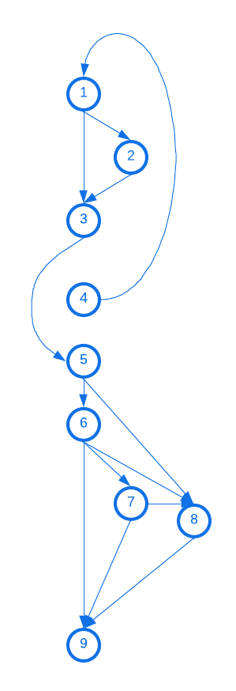

# af-testes

erros no código:

- O nome da classe sendo instanciada pra conectar com o banco "com.mysql.Driver.Manager" está errada, deveria ser "com.mysql.cj.jdbc.Driver"
- string de conexão está errada:
string atual: "fdbc:mysql://127.0.0.1/test?=user=lopes&password=123";
string correta: "jdbc:mysql://localhost/test?user=minty&password=greatsqldb"
erros:
    - fdbc ao invés de jdbc;
    - "=" no começo dos parâmetros, antes de user, não deveria existir
- não necessáriamente um erro (não vai quebrar o código), mas não há um tratamento de erro efetivo, os catchs existem mas não é feito nada com o erro, nenhuma mensagem é exibida nem nada
- falha de segurança: credenciais do bd digitados no código

testes:
estrutura de controle: ok
- todos os trechos de código são executados

teste de condição: ok
- if (rs.next())
    - rs.next() = true
    - rs.next() = false

teste de fluxo de dados: ok, todas as variáveis são declaradas antes do uso, e todas são utilizadas
- Connection conn = null;
- String url = "fdbc:mysql://127.0.0.1/test?=user=lopes&password=123";
- public String nome = "";
- public boolean result = false;
- String sql = "";
- Connection conn = conectarDB();
- Statement st = conn.createStatement()
- ResultSet rs = st.executeQuery(sql);

teste de ciclo: ok, não há loops

Grafo de fluxo:

Complexidade ciclomática (M)
M = E - N + 2P
E (arestas) = 12
N (nós) = 9
P (componentes conectados) = 2
M = 12 - 9 + (2*2)
M = 3 + 4 = 7

Caminhos possíveis
4-1-3-5-6-9
4-1-2-3-5-8-9
4-1-3-5-6-8-9
4-1-3-5-6-7-8-9
4-1-3-5-8-9
4-1-3-5-6-7-9

Fontes:
[classe mysql](https://dev.mysql.com/doc/connector-j/en/connector-j-usagenotes-connect-drivermanager.html)